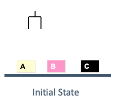
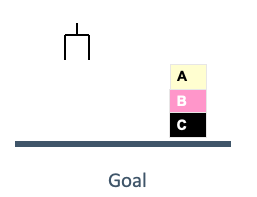

## Blocksworld
This domain is one of the first planning models. It consists of a hand robot that can pick up or drop blocks for recycling purpose. Initially, all blocks are on a conveyor belt (or a table) as shown in the figure: 



The goal is that the blocks are stacked as in the figure:



The hand robot distinguished between blocks on the belt or on top or other blocks. Then 4 different actions are needed. 

Create a file called *blocks.pddl* and copy the following domain description:
```
(define (domain blocks)
  (:requirements :strips)
  (:predicates 
           (on ?x ?y)
         (ontable ?x)
         (clear ?x)
         (handempty)
         (holding ?x)
         )
  (:action pick-up
       :parameters (?x)
       :precondition (and (clear ?x) (ontable ?x) (handempty))
       :effect (and (not (ontable ?x))
                    (not (clear ?x))
                    (not (handempty))
                    (holding ?x))
   )
  (:action unstack
       :parameters (?x ?y)
       :precondition (and (on ?x ?y) (clear ?x) (handempty))
       :effect (and (holding ?x)
                    (clear ?y)
                    (not (clear ?x))
                    (not (handempty))
                    (not (on ?x ?y)))
   )  
  (:action stack
       :parameters (?x ?y)
       :precondition (and 
       :effect
       (and 
       )
   )
  (:action put-down
       :parameters (?x)
       :precondition 
       :effect
       (and 
       )
   )  
)
```
Do the following steps:

 1. Write the *stack* and *put-down* actions.
 2. Write the domain problem based on the situation of both previous figures. 
 3. Run the planning model.
 4.  Change the initial state to the following one and run the model.
 ```
 (clear c) (clear b) (ontable a) (ontable b) (on c a)
```
 5. Modify the domain so it can consider types, i.e. *block*. Modify the domain and the problem in order to support it.
 6. Consider the object declaration:
```
(:objects C D E F B I J A N O K M P H G L Q - block)
```
and the goal declaration 
```
(and (on Q N) (on N L) (on L O) (on O J) (on J H) (on H C) (on C E)
     (on E M) (on M P) (on P A) (on A G) (on G B) (on B I) (on I K)
     (on K F) (on F D))
```
Define the initial state that you want and run it.


