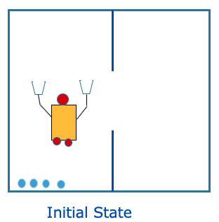
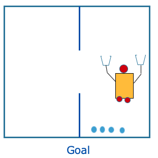

## Gripper

This domain is about a robot that can move between two rooms and pick up or drop balls with either of its two arms. 

The planning model (domain and problem) will consist of:
 -  Objects: the two rooms, balls and two robot arms (problem)
 -   Predicates: Is x a room? Is x a ball? Is ball x inside room y? Is
   robot arm x empty? (domain)
   -    Initial state: all balls and the robot are in the first room. All
   robot arms are empty (problem)
   -    Goal specification: all balls must be in the second room (problem)
   -    Actions/Operators: the robot can move between rooms, pick up a ball or drop a ball (domain)

Initially, all balls and the robot are in the first room. We want the balls to be in the second room. The figure shows the initial state:



And the next figure shows the goal state:



Create a file called *gripper.pddl* and copy the following domain description:
```
(define (domain gripper)
   (:predicates (ROOM ?r)
                (BALL ?b)
                (GRIPPER ?g)
                (at-robby ?r)
                (at-ball ?b ?r)
                (free ?g)
                (carry ?g ?b))
   (:action move
       :parameters (?x ?y)
       :precondition (and (ROOM ?x)
                          (ROOM ?y)
                          (at-robby ?x)
                     )
       :effect (and (at-robby ?y)
                    (not (at-robby ?x))
               )
   )
   (:action pick-up
       :parameters (?ball ?room ?gripper)
       :precondition (and (BALL ?ball)
                          (ROOM ?room)
                          (GRIPPER ?gripper)
                          (at-ball ?ball ?room)
                          (at-robby ?room)
                          (free ?gripper)
                     )
       :effect (and (carry ?gripper ?ball)
                    (not (at-ball ?ball ?room)) 
                    (not (free ?gripper))
               )
   )
   (:action drop
       :parameters (?ball ?room ?gripper)
       :precondition (and (BALL ?ball)
                          (ROOM ?room)
                          (GRIPPER ?gripper)
                          (carry ?gripper ?ball)
                          (at-robby ?room)
                     )
       :effect (and (at-ball ?ball ?room)
                    (free ?gripper)
                    (not (carry ?gripper ?ball))
               )
   )
)
```
Create a new file called *gripper-four-balls.pddl* and copy the following problem description:
```
(define (problem gripper-four-balls)
   (:domain gripper)
   (:objects rooma roomb
             ball1 ball2 ball3 ball4
             left right)
   (:init (ROOM rooma)          (ROOM roomb)
          (BALL ball1)          (BALL ball2)
          (BALL ball3)          (BALL ball4)
          (GRIPPER left)        (GRIPPER right)
          (at-robby rooma)
          (free left)          (free right)
          (at-ball ball1 rooma)  (at-ball ball2 rooma)
          (at-ball ball3 rooma)  (at-ball ball4 rooma)
   )
   (:goal (and (at-ball ball1 roomb)
               (at-ball ball2 roomb)
               (at-ball ball3 roomb)
               (at-ball ball4 roomb)
          )
   )
)
```
Do the following steps:
 1. Run the planning model using the on-line editors mentioned before, and check the results:
 [Editors](https://github.com/Malola2015/planningCourse/blob/master/assignments/GettingStarted.md#exercises)
 2.  Place two of the balls and the gripper in roomb. The goal is that all balls are in rooma. Run the new model.
 3. Add two more balls and place them when you decide. The goal is that 5 balls are in the same room and the one remaining, in the other room. Run the new model.
 4. Extend the gripper domain to allow the definition of types. For that:
    - Add in the domain the types as follow: 
      ```(:requirements :strips :typing)      
         (:types room ball gripper)``` 
    - In the operators, specify the type:
       ```:parameters (?b - ball ?r - room ...)```
   
    - In the problem, define the type of the objects:
    ```(:objects rooma roomb - room 
                 ...
       )```

