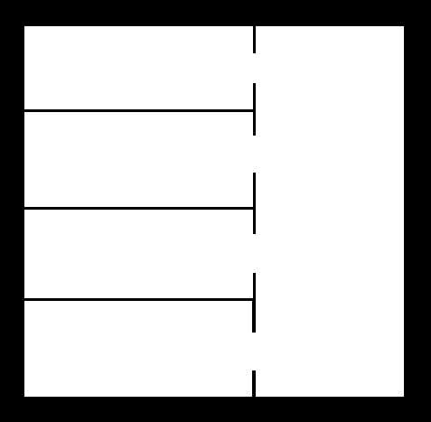

## Robot motion planning

The original STRIPS program was designed to control Shakey, a robot that roamed the halls of SRI in the early 1970s. It turns out that most of the work on STRIPS involved simulations where the actions performed were just printing to a terminal, but occasionally Shakey would actually move around, grab, and push things based on the plans created by STRIPS. The figure shows a version of Shakey’s world consisting of four rooms lined up along a corridor, where each room has a door and a light switch.

Shakey can move from place to place, push movable objects (such as boxes), climb on and off of rigid objects (such as boxes) and turn light switches in and off. There are 6 actions:

* Go from current location x to location y: Go (x,y) moves from x to y (that cannot be the same room). By convection there is a room between rooms.
* Push an object b from location x to location y: Push(b,x,y).
* Climb up/down onto a box: Climb(b).
* Switch on/off  the  light. Because Shakey is short, this can only be done when Shakey is on top of a box that is at the room location.

Do the following steps:

 1. Define the domain and the problem for the Shakey world considering that Shakey is on the top room with 2 boxes and all the switches are off. The goal is that all switches are on.
 2. Define types.
 3. Extend the domain to include the actions Open and Close.  As preconditions for the Go action, add that the door should be open. Assume that when pushing or switching the interrupter is enough that they are in the same place (don't subdivide the map on cells since it will complicate the model). 
 4. Generate other problem(s) with higher/lesser number of rooms and boxes randomly distributed. Note that rooms can be (or not) connected with a corridor.
