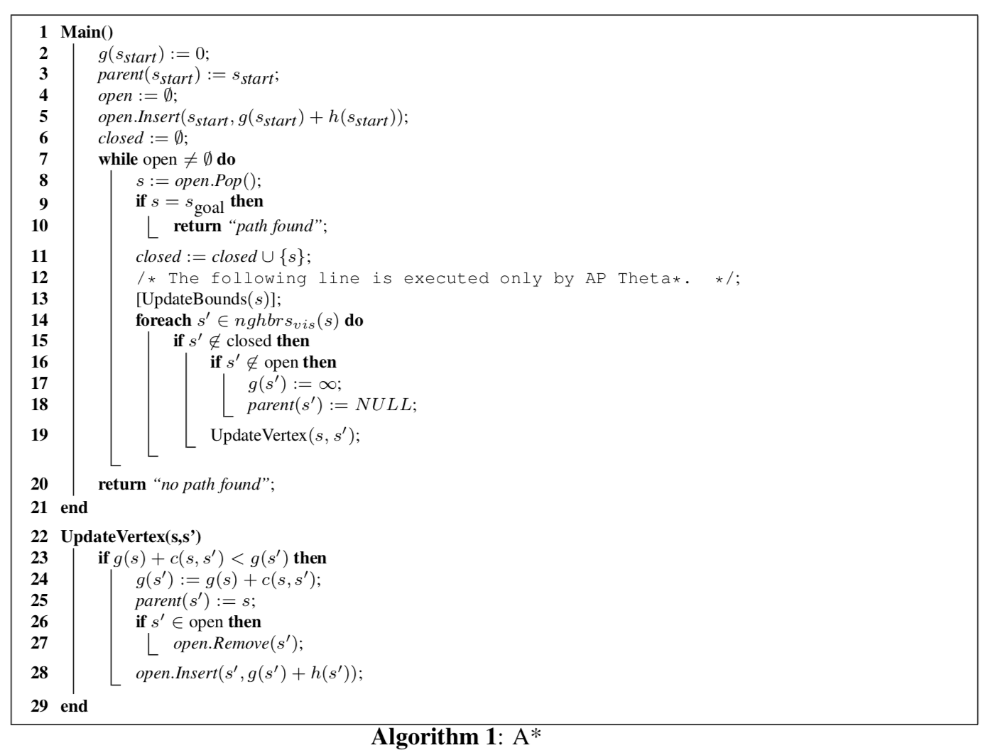
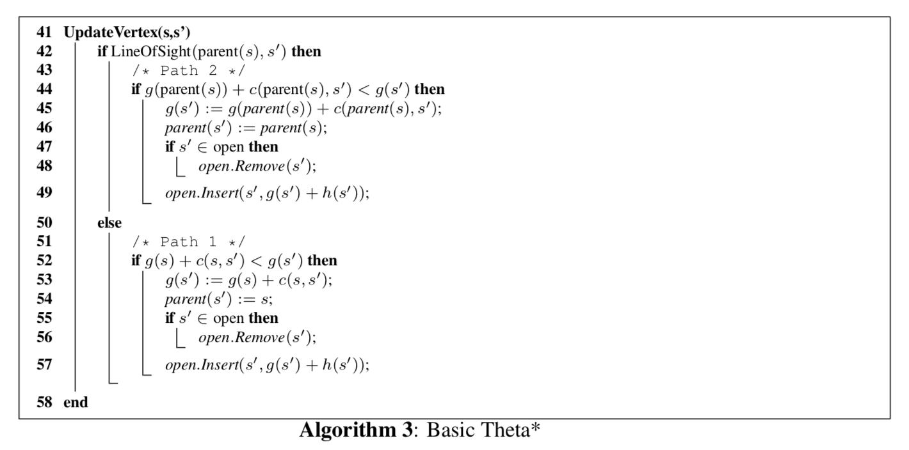
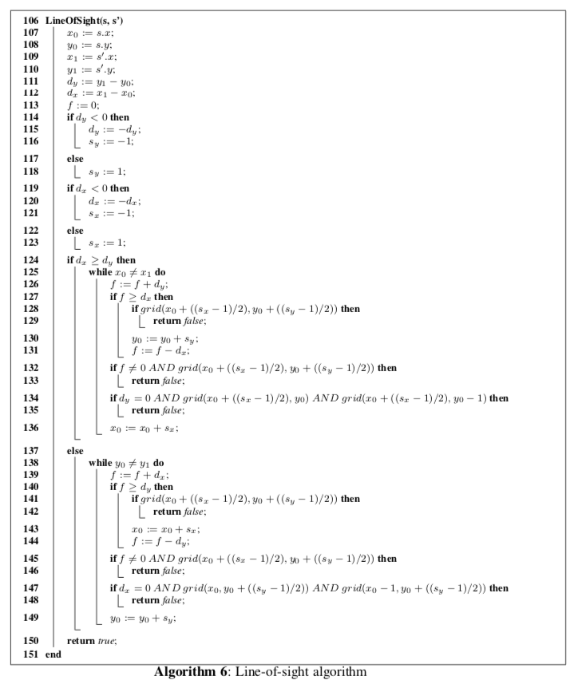

# Integrate path-planning and task-planning

## Objectives

* Compare Dijkstra, A* and Theta* algorithms.
* Implement Theta* and some heuristics.
* Compare the heuristics and understand the impact on the solution.
* Use a graphical interface to visualize the results.
* Integrate path-planning and task-planning.


## Dependencies

Install [PathPlanPrinter](https://github.com/R012/PathPlanPrinter), which depends on the libraries numpy and PIL or Pillow. Read the README.md file in the project's root folder for instructions about the usage and how to download it from GitHub.


## Practical assignment

### Path-planning
Perform the following tasks:

1. Consider that the robot is initially located at the position (10,10) and the goal is to be at position (15,15) in the map `test_2.png` placed in the ```../res/``` folder. Visualize the computed path using the Dijkstra algorithm. The solution will be saved in the ```../out/``` folder. It's advisable for the grid size to use values between 15 and 40 in order not to lose precision without compromising efficiency.


   ```python run_path_planning.py --scenario  ../res/test_2.png --start "(10,10)" --finish "(15,15)" --grid_size 40 --algorithm Dijkstra --heuristic naive```

2. Change the initial point to  (27,19) and the goal point to (8,20). Run the problem using the A* algorithm with the naive heuristic.
   
3. We provide you with the implementations of A* and Dijkstra in the ```/src/``` folder. The implementation of A* is based on the  pseudo-code of the next figure taken from [Theta*: Any-Angle Path Planning on Grids](https://arxiv.org/pdf/1401.3843.pdf):



4. Implement Theta* using the following pseudo-code:



Take into account that the difference between A* and Theta* is the Line of sight. Here is the code to calculate it:



5. Which heuristic is used by default? If needed, use the path-planning visualizer in https://qiao.github.io/PathFinding.js/visual/ to reconstruct the scenario and observe the node expansion using different algorithms.

6. Implement the Euclidean, Manhattan and Octile heuristics for A*/Theta*. These functions take the initial and final points as tuples (X, Y) and must return a float with the heuristic value.

7. Create the image given on [slide 19](https://github.com/Malola2015/planningCourse/blob/master/robotics/pathplanning.pdf), set the grid size as 40, run the 3 algorithms and compare the results, changing the heuristic. Capture the images of the solution and upload them with the rest of the files.


### Integration

Once the path-planning algorithms are ready, we want to call them to avoid the PDDL planner to calculate paths between tasks. Do the following tasks:

1. Modify the [Planetary exploration on Mars](https://github.com/Malola2015/planningCourse/blob/master/assignments/PlanetaryExploration.md) domain to consider the coordinates as objects of the type ```Point```. For example, X=6 Y=10 will be represented as the object P0610. Now, you can delete all the obstacles since the path will be now delegated to the path-planner algorithm, freeing the PDDL planner from it.

2. Run the new domain (if you have modelled it in a different way) and save the solution into a file called ```planning.txt```. This file will be the input to an integration program that will call the path-planning algorithm.

3. Copy the code provided in the following link to a file called ```run_integration.py```. 

   https://gist.github.com/R012/0fe8ec73b58c0a95844370c6510454d9

4. That code reads the PDDL output, and each time there is a ```move``` action with a coordinate, it calls the path-planning algorithm with the destination given by the action. By default, the initial state is set to the position = (10, 10) in the ```visualize_paths_from_pddl``` function. Please change it accordingly to your initial state in your PDDL file.

5. Note that you have to provide the route and names to both, the solution of the planner, i.e.```planning.txt``` (placed in this case in the ```/res/``` folder) and the map with the obstacles, i.e.```example.png``` (placed in the same folder). You can place those files when you want, just remember to specify the route. The code that you have to modify is:

    ``` task_plan = generate_task_list('../res/planning.txt')``` 

    ```visualize_paths_from_pddl(task_plan, '../res/example.png')``` 

5. Run the ```run_integration.py``` file and see the result. 

6. Change the heuristics and the algorithms modifying the inputs to the call to the ```run_path_planning``` function.


### What else?

Write in a .doc file if what you have implemented so far is enough to autonomously control the robot. What else is needed? You don´t need to implement anything (but you can do it if you want), it is more a reflexion for building intelligent robots from the planning and execution point of view.


